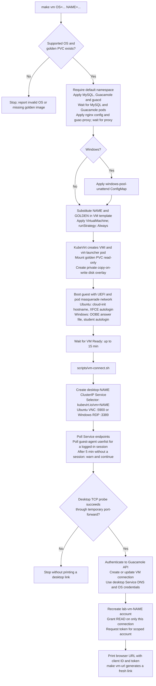
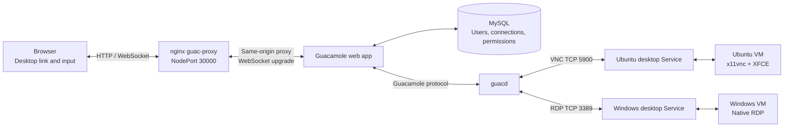

# Lab platform flow diagrams

These diagrams follow the current Makefile, provisioning scripts, and deployment
templates. View this file in a Markdown preview with Mermaid support.

## 1. Cluster and golden-image workflow

A golden image is a reusable installed OS disk. CDI (Containerized Data Importer)
imports or uploads installation media; Packer installs and provisions the OS in a
temporary KubeVirt VM. The resulting PVC (PersistentVolumeClaim) stores the disk.

```mermaid
flowchart TD
    Start["make cluster"] --> Tools["Check docker, kind, kubectl, packer,<br/>virtctl, git and go"]
    Tools --> Setup["scripts/setup-cluster.sh"]
    Setup --> Exists{"kind cluster exists?"}
    Exists -->|No| Kind["Create kind cluster<br/>kindest/node:v1.35.0"]
    Exists -->|Yes| Reuse["Reuse cluster"]
    Kind --> KV
    Reuse --> KV
    KV["Apply KubeVirt v1.8.2 operator and CR<br/>Wait for operator and KubeVirt Available"]
    KV --> CDI["Apply CDI v1.65.0 operator and CR<br/>Wait for operator and CDI Available"]
    CDI --> Choice{"Choose golden image"}
    Choice -->|Ubuntu| UCmd["make golden-ubuntu"]
    Choice -->|Windows| WCmd["make golden-windows"]
    UCmd --> UP["Build and install local Packer plugin fork"]
    WCmd --> WP["Build and install local Packer plugin fork<br/>Check xorriso, curl and 7z"]
    UP --> UI["Apply ubuntu-2404-iso DataVolume<br/>CDI imports Ubuntu 24.04 ISO<br/>Wait for Ready: up to 20 min"]
    UI --> UB["Packer boots temporary UEFI VM<br/>20 GiB target disk<br/>cidata media: user-data and meta-data"]
    UB --> UA["Unattended Ubuntu installation<br/>Packer connects over forwarded SSH"]
    UA --> UD["setup-desktop.sh<br/>Install XFCE, LightDM and x11vnc<br/>Configure student autologin and VNC :5900"]
    UD --> UG["Clean cloud-init state<br/>Clear hostname and machine-id; sync"]
    UG --> UGold[("ubuntu-golden<br/>DataVolume / PVC / DataSource")]
    WP --> WI["Reuse cached Windows ISO or download<br/>Verify configured size and SHA256 on download"]
    WI --> WR["Extract with 7z; repack with xorriso<br/>Inject Autounattend.xml into root and sources<br/>Include BIOS and EFI boot images"]
    WR --> Upload["Recreate windows-iso DataVolume / PVC<br/>Wait for UploadReady<br/>Forward CDI upload proxy to localhost:18443"]
    Upload --> WD["virtctl image-upload: repacked ISO<br/>Wait for windows-iso Ready: up to 10 min"]
    WD --> WB["Packer Windows build<br/>Detailed provisioning flow below"]
    WB --> WGold[("windows-golden<br/>DataVolume / PVC / DataSource")]
    UGold --> Run["make vm OS=ubuntu or windows NAME=..."]
    WGold --> Run
```

Sources: [Makefile](../Makefile), [cluster setup](../scripts/setup-cluster.sh),
[Ubuntu Packer template](../golden/ubuntu/ubuntu.pkr.hcl),
[Windows Packer template](../golden/windows/windows.pkr.hcl).

## 2. Windows installation and provisioning

The installer answer file controls the Windows setup passes. The three scripts
on `F:` run synchronously in the order shown; Packer connects only after WinRM is
enabled. OOBE means Windows' out-of-box setup experience.

```mermaid
flowchart TD
    Boot["Packer creates temporary UEFI build VM<br/>64 GiB target disk; Windows ISO<br/>VirtIO media at E:; script media at F:"]
    Boot --> PE["autounattend.xml: windowsPE<br/>Set en-US locale; load VirtIO storage driver<br/>Partition disk 0: recovery, EFI, MSR, Windows<br/>Install Windows 10 Enterprise Evaluation"]
    PE --> Specialize["specialize pass<br/>Set locale; skip automatic activation"]
    Specialize --> Audit["oobeSystem pass<br/>Reseal into Audit mode<br/>Administrator autologin"]
    Audit --> Misc["auditUser step 1: install-misc.ps1<br/>Install VirtIO drivers and QEMU guest agent<br/>Rename cached installation unattend.xml"]
    Misc --> Network["auditUser step 2: set-network.ps1<br/>Set network profile to Private"]
    Network --> WinRM["auditUser step 3: enable-winrm.ps1<br/>Enable PowerShell remoting and CredSSP<br/>Enable Basic auth and unencrypted WinRM<br/>Open TCP 5985 in Windows Firewall"]
    WinRM --> Connect["Packer connects as Administrator<br/>Kubernetes API port-forward to WinRM<br/>Connection timeout: 30 min"]
    Connect --> Provision["scripts/setup.ps1 via WinRM<br/>Create student account<br/>Add Administrators and Remote Desktop Users<br/>Enable RDP and its firewall rules<br/>Disable Windows Update"]
    Provision --> Answer["Write runtime OOBE answer file into Panther<br/>Skip setup screens; autologin as student<br/>Stop audit-mode Sysprep dialog"]
    Answer --> Sysprep["Packer runs Sysprep<br/>/generalize /oobe /shutdown /mode:vm<br/>WinRM disconnect during shutdown is expected"]
    Sysprep --> Golden[("Retain installed disk as windows-golden")]
    Golden --> Runtime["New desktop VM mounts golden PVC<br/>with its own writable overlay<br/>Mount windows-pool-unattend ConfigMap"]
    Runtime --> OOBE["Windows completes OOBE using answer file<br/>Student autologin; RDP :3389"]
```

Sources: [installer answer file](../golden/windows/autounattend.xml),
[driver installation](../golden/windows/install-misc.ps1),
[network setup](../golden/windows/set-network.ps1),
[WinRM setup](../golden/windows/enable-winrm.ps1),
[desktop provisioning](../golden/windows/scripts/setup.ps1),
[runtime answer file](../deploy/windows-pool-unattend.yaml).

## 3. VM creation and browser connection

`VM Ready` is the Makefile's first readiness gate. The connection script separately
checks guest sessions and the desktop port; the session check is best-effort,
while failure of the TCP probe stops link generation.

### Live desktop traffic

### Disk lifetime

- Each VM writes to its own overlay; the shared golden PVC stays unchanged.
- A guest reboot retains the overlay. Deleting or replacing the VMI discards it.
- A new VMI starts from the golden image again; Windows completes OOBE again.
- `make vm-delete` deletes the VM and Service; its Guacamole connection and account remain.
- CDI participates in image preparation; runtime VM creation mounts the golden PVC directly.

Sources: [VM commands](../Makefile), [connection script](../scripts/vm-connect.sh),
[Ubuntu VM](../deploy/vm-ubuntu.yaml), [Windows VM](../deploy/vm-windows.yaml),
[Guacamole stack](../deploy/guacamole.yaml), [proxy configuration](../portal/nginx.conf).
